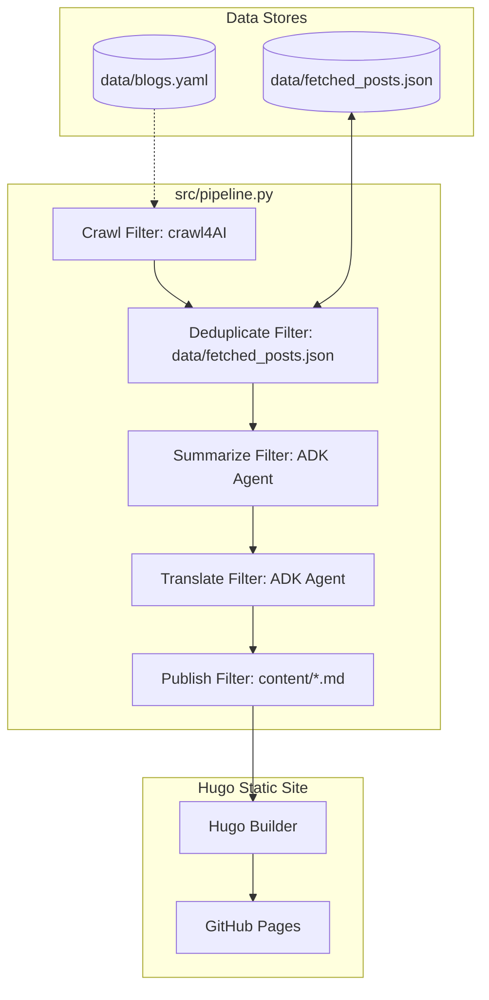

# Architecture Spine — daily-ai-news

## Design Paradigm

Pipes-and-Filters. The system is a sequential data pipeline executing discrete filters in order:
1. **Crawl Filter**: Scrapes news blogs listed in registry.
2. **Deduplicate Filter**: Filters already-processed URLs.
3. **Summarize Filter**: Uses ADK agent to extract 5-element structured insights.
4. **Translate Filter**: Translates summaries to Traditional Chinese (Taiwan), keeping terms like prompt, fine-tuning, RAG, agent, and pipeline in English.
5. **Publish/Build Filter**: Writes structured YAML data into daily markdown pages and builds/deploys the static Hugo site.

## Invariants & Rules

### AD-1 — Pipes-and-Filters Execution

- **Binds:** FR-1, FR-2, FR-3, FR-4, FR-8, FR-9
- **Prevents:** Ad-hoc scripting, mixed concerns, and complex state mutation across pipeline stages.
- **Rule:** The pipeline must execute sequentially with immutable stage boundaries. Each stage operates strictly on the output of the preceding stage.

### AD-2 — Single Entrypoint Python Script

- **Binds:** all Python components
- **Prevents:** Scattered scripts, orchestration complexity, and inconsistent virtual environments.
- **Rule:** The pipeline entrypoint must be `src/pipeline.py`, coordinating modular functions located in `src/`. It must run using `uv run`.

### AD-3 — YAML Registry & JSON Deduplication Store

- **Binds:** FR-1, FR-2
- **Prevents:** Missing blog configurations and duplicate article summaries.
- **Rule:** Blog targets must be defined in `data/blogs.yaml`. Crawled and processed URLs must be tracked in `data/fetched_posts.json`.

### AD-4 — Two-Step Agentic Summarization & Translation

- **Binds:** FR-3, FR-4
- **Prevents:** Unstructured summaries and poorly localized Traditional Chinese terminology.
- **Rule:** The agentic process must run in two distinct steps: (1) structured 5-element summarization in English using Gemini via Google ADK, (2) translation of the generated English summary to Traditional Chinese (Taiwan) keeping standard developer terms in English.

### AD-5 — Zero-Dependency Custom Hugo Layouts

- **Binds:** FR-5, FR-6, FR-7
- **Prevents:** Dependency bloat, layout drift, and styling mismatch with the UX design specification.
- **Rule:** The Hugo site must be located at the project root and use custom layouts under `layouts/` with custom CSS in `static/css/index.css`. No external Hugo themes are permitted.

### AD-6 — Structured Frontmatter Storage

- **Binds:** FR-5, FR-6, FR-7
- **Prevents:** Client-side HTML parsing overhead and markdown rendering inconsistency in the split-pane layout.
- **Rule:** Daily summaries must be stored as a structured YAML array (`articles` key) in the frontmatter of `content/en/posts/YYYY-MM-DD.md` and `content/zh-tw/posts/YYYY-MM-DD.md`. Client-side JavaScript must parse this frontmatter to toggle article views in the split-pane UI.

### AD-7 — Fault-Tolerant Pipeline Execution

- **Binds:** FR-1, FR-2, FR-3, FR-4, FR-8
- **Prevents:** Single blog network or API failures blocking the entire daily pipeline run.
- **Rule:** Failures during crawling or summarization of a single blog must be logged and reported at the end. The pipeline must proceed to process all other blogs.



## Consistency Conventions

| Concern | Convention |
| --- | --- |
| Naming (entities, files, interfaces, events) | Files: lowercase with hyphens (e.g., `2026-07-11.md`). Code: snake_case for Python, camelCase for JS. |
| Data & formats (ids, dates, error shapes, envelopes) | Dates: YYYY-MM-DD. Error shapes: JSON logs with keys `timestamp`, `stage`, `blog_url`, `error_message`. |
| State & cross-cutting (mutation, errors, logging, config, auth) | State: pipeline runs stateless, using only `data/fetched_posts.json` as persistent state. Logging: stdout/stderr. |

## Stack

| Name | Version |
| --- | --- |
| Python | 3.11+ |
| Hugo | 0.120+ |
| crawl4AI | 0.4+ |
| google-adk | 0.1+ |
| GitHub Actions | v4 |

## Structural Seed

```text
daily-ai-news/
  .github/
    workflows/
      pipeline.yml         # daily pipeline schedule
  content/
    en/
      posts/
        YYYY-MM-DD.md     # English daily articles frontmatter + body
    zh-tw/
      posts/
        YYYY-MM-DD.md     # Traditional Chinese daily articles frontmatter + body
  data/
    blogs.yaml            # list of target blog URLs
    fetched_posts.json    # deduplication store of processed URLs
  layouts/                # custom Hugo templates
  static/
    css/
      index.css           # custom style according to DESIGN.md
    js/
      main.js             # client-side split-pane switcher
  src/
    __init__.py
    pipeline.py           # pipeline entrypoint
  hugo.toml               # Hugo site configuration
```

## Capability → Architecture Map

| Capability / Area | Lives in | Governed by |
| --- | --- | --- |
| Crawl Blog Registry (FR-1) | `src/pipeline.py` (crawl filter) | AD-1, AD-2, AD-3 |
| Deduplicate Articles (FR-2) | `src/pipeline.py` (deduplicate filter) | AD-1, AD-2, AD-3 |
| Structured Summaries (FR-3) | `src/pipeline.py` (summarize filter) | AD-1, AD-2, AD-4 |
| Translate Summaries (FR-4) | `src/pipeline.py` (translate filter) | AD-1, AD-2, AD-4 |
| Render Archive (FR-5) | `layouts/` templates | AD-5, AD-6 |
| Render Split-Pane (FR-6) | `layouts/`, `static/js/main.js` | AD-5, AD-6 |
| Multilingual Switcher (FR-7) | `layouts/` templates | AD-5, AD-6 |
| Daily Actions Schedule (FR-8) | `.github/workflows/pipeline.yml` | AD-1, AD-2 |
| Commit Updates (FR-9) | `.github/workflows/pipeline.yml` | AD-1 |

## Deferred

- Gemini Model Version: Deferred to implementation runtime configuration (e.g. env variables).
- Exact Crawler Settings: Wait-times, retries, and rate limiters deferred to crawl4AI configuration in implementation.
- Visual Design details: Specific CSS layouts and color hex variables are governed by the UX DESIGN.md, deferred from this architectural contract.
