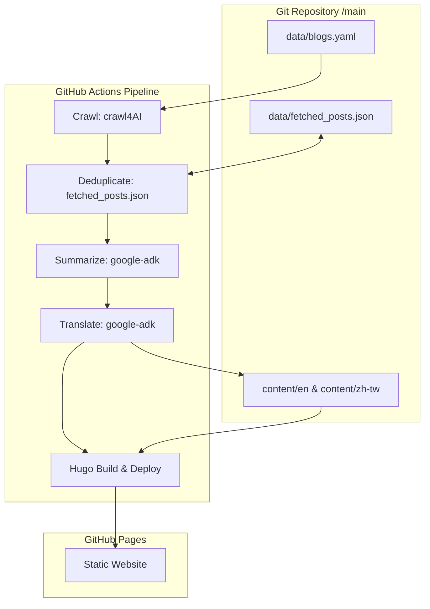

# Solution Design Document: Daily AI News Summary Website

This document details the software architecture, data workflow, and technical stack for the Daily AI News Summary Website. It is designed for internal developers and maintainers.

## 1. System Overview

The system is a fully automated, serverless daily news pipeline that crawls registered AI blogs, processes and translates the content using Gemini via the Google Agent Development Kit (ADK), and publishes a multilingual static website on GitHub Pages via Hugo.

## 2. Technical Stack

- **Pipeline Language**: Python 3.11+ managed by `uv` for modern package management and fast virtual environments.
- **Web App Engine**: Hugo (Static Site Generator) for speed, multilingual routing, and zero-cost hosting.
- **Web Scraper**: `crawl4AI` for robust page scraping and main-content extraction in GitHub Actions.
- **AI Orchestration**: Google Gen AI SDK via `google-adk` for structured summaries and translations.
- **Scheduler & Host**: GitHub Actions (Cron execution at 7:00 AM UTC+8) and GitHub Pages (hosting).

## 3. Data Pipeline (Pipes-and-Filters)

The pipeline is coordinated by a single Python script (`src/pipeline.py`) running the following sequential filters:

### Stage 1: Crawl
- Read the target blog URLs from `data/blogs.yaml`.
- Use `crawl4AI` to fetch and extract the clean text body (excluding headers, footers, and sidebars).

### Stage 2: Deduplicate
- Load `data/fetched_posts.json`.
- Skip articles whose URLs are already recorded.

### Stage 3: Summarize
- Process each new article body via Gemini using a structured prompt.
- Output the 5-element Technical Summary in English:
  1. **TL;DR**: One-sentence conclusion.
  2. **Problem/Why**: Pain point description.
  3. **Solution/How**: Architectural mechanism description.
  4. **Insights & Trade-offs**: Side-by-side Pros and Cons list.
  5. **Tags & Action**: Actionability tags, rating (1-5 stars), and source link.

### Stage 4: Translate
- Translate the generated English summary into Traditional Chinese (Taiwan).
- Enforce developer-native terminology by keeping standard terms (`prompt`, `fine-tuning`, `RAG`, `agent`, `pipeline`, `embeddings`, `token`, `checkpoint`) in English.

### Stage 5: Daily Highlight & Publish
- Feed all compiled summaries from the day into a final ADK call to generate a short Daily Highlight summary.
- Format the results into a YAML array under the `articles` frontmatter key of daily posts:
  - English: `content/en/posts/YYYY-MM-DD.md`
  - Traditional Chinese: `content/zh-tw/posts/YYYY-MM-DD.md`
- Append newly crawled URLs to `data/fetched_posts.json` and commit back to the `main` branch.

## 4. Frontend & Layout Design

The frontend is a zero-dependency Hugo layout that matches the dual-pane, high-density dashboard mockup.

### Multilingual Routing
- English version: `/en/`
- Traditional Chinese version: `/zh-tw/`
- A language toggle in the global header allows users to switch locales on the active page.

### Split-Pane Layout (Detail View)
- **Left Sidebar**: Contains a search bar, tag filter pills, and a list of scrollable article cards for the day.
- **Right Panel**: Displays the selected article details (TL;DR box, Problem, Solution, Insights side-by-side Pros/Cons, and rating stars).
- **Interactive Switcher**: Tapping an article card in the sidebar uses client-side JavaScript (`static/js/main.js`) to parse the YAML frontmatter array and instantly populate the details panel without reloading the page.
