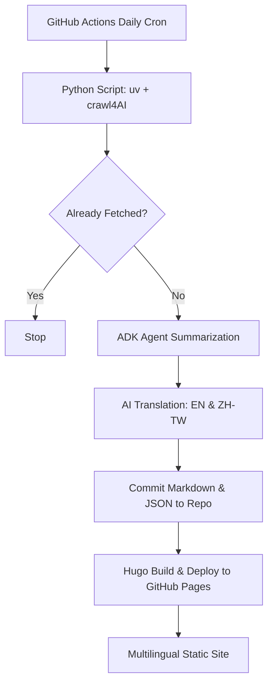

# Product Brief: Daily AI News Summary Website

## Executive Summary

The **Daily AI News Summary Website** is an automated, multilingual platform designed to track, summarize, and translate high-value technical updates from leading AI research and engineering blogs. By leveraging AI-driven crawling, structured agentic summarization, and automated localization, the site delivers concise, high-signal updates to developers and researchers daily.

The system runs entirely as a serverless static website hosted on GitHub Pages using Hugo. The backend pipeline is automated via GitHub Actions, combining a Python script (managed by `uv` and powered by `crawl4AI`) and AI agents built with ADK to fetch new articles, extract core insights, translate them, and commit the updated content directly back to the repository.

## The Problem

Staying updated with the rapid pace of artificial intelligence is challenging. AI researchers and developers face:
1. **Information Overload:** A massive volume of articles, papers, and blog posts are published daily, many containing marketing fluff or generic descriptions.
2. **Lack of Structure:** Different blogs present information in varied layouts, making it slow to scan and identify key technical contributions, trade-offs, and data.
3. **Language Barriers:** High-quality AI technical blogs are primarily published in English, creating a barrier for Traditional Chinese (Taiwan) readers who want to digest news quickly in their native language.

## The Solution

An automated, daily-updated static site that presents structured, multilingual technical summaries of articles from configured blogs. 

Each article is summarized using a strict 5-element technical summary framework:
1. **TL;DR:** A one-sentence conclusion of the core contribution.
2. **Problem/Why:** The underlying pain point or limitations of existing solutions.
3. **Solution/How:** The core mechanism and architectural explanation.
4. **Insights & Trade-offs:** Detailed data points, pros, and cons.
5. **Tags & Action:** Actionability score, ratings, and category hashtags.

## What Makes This Different

* **High-Signal Technical Depth:** Unlike general AI news aggregators, this project focuses strictly on technical blogs (e.g., Anthropic Research/Engineering, GitHub Blog, Latent Space) and filters for engineering substance.
* **Strict Elicitation Structure:** Summaries are not generic paragraphs; they follow a standardized markdown template designed for rapid scanning by engineers.
* **Fully Automated Serverless Architecture:** The entire crawl, summarization, translation, storage (flat JSON file), and deployment cycle runs on GitHub Actions, requiring zero ongoing server costs.
* **High-Quality Localization:** Built-in AI translation tailored specifically for Traditional Chinese (Taiwan) terminology. It avoids over-translating common English technical terms (e.g., prompt, fine-tuning, agent, RAG) in line with Taiwan's technical developer culture.

## Who This Serves

* **AI Engineers & Developers:** Who need to understand how other labs are building, optimizing, and deploying models without spending hours reading long-form posts.
* **AI Researchers & Enthusiasts:** Looking for high-signal summaries of breakthroughs and technical reports.
* **Traditional Chinese (Taiwan) Tech Community:** Readers who want high-fidelity local translations of cutting-edge AI engineering news.

## Success Criteria

* **Automation Reliability:** The GitHub Actions workflow triggers daily and successfully handles new articles without manual intervention.
* **Deduplication:** No article is summarized or published more than once.
* **Multilingual Coverage:** 100% of crawled articles have both English and Traditional Chinese versions available.
* **Scanning Speed:** An engineer can grasp the core technical contribution, trade-offs, and applicability of a post in less than 30 seconds.

## Scope

### In-Scope (V1)
* **Crawling Pipeline:** Python script managed by `uv` using `crawl4AI` to extract clean markdown/text content from a list of configured blogs.
* **Initial Blog Registry:** Support crawling from:
  * GitHub Blog (`https://github.blog/`)
  * Anthropic Engineering (`https://www.anthropic.com/engineering`)
  * Anthropic Research (`https://www.anthropic.com/research`)
  * Simon Willison's Weblog (`https://simonwillison.net/`)
  * Latent Space (`https://www.latent.space/`)
  * Hamel Husain's Blog (`https://hamel.dev/`)
* **Deduplication:** A simple committed `fetched_posts.json` file in the repo to keep track of already processed URLs and dates.
* **ADK Agent Summarizer:** An AI agent built using the **Agent Development Kit** (`google-adk` in Python from https://adk.dev/) to produce structured 5-element Markdown summaries.
* **Multilingual Translation:** AI-driven translation of summaries between English and Traditional Chinese (Taiwan), keeping industry-standard English terminology untranslated.
* **Hugo Static Site:**
  * Support for English (`en`) and Traditional Chinese (`zh-tw`).
  * Custom Hugo templates to render daily news summaries.
  * Custom index pages showing summary cards, tags, and ratings.
* **CI/CD Automation:** GitHub Actions workflow running on a daily schedule to execute the crawling, summarizing, translating, committing files to git, and deploying to GitHub Pages.

### Out-of-Scope (V1)
* Live user registration, comments, or interactive bookmarks (pure static site).
* Non-text blog crawling (e.g., video or audio-only feeds).
* Real-time search indexing (relying on simple Hugo client-side or built-in search if needed, but not dedicated elastic/algolia integrations for V1).

## Vision

* **Expanded Blog Registry:** A configuration file allowing users to easily add new RSS feeds or site URLs to the crawl registry.
* **Weekly Newsletter:** Automated email digests of the top-rated AI articles of the week.
* **Interactive AI Chat:** Allowing readers to query the historical database of summarized articles to find cross-references.
